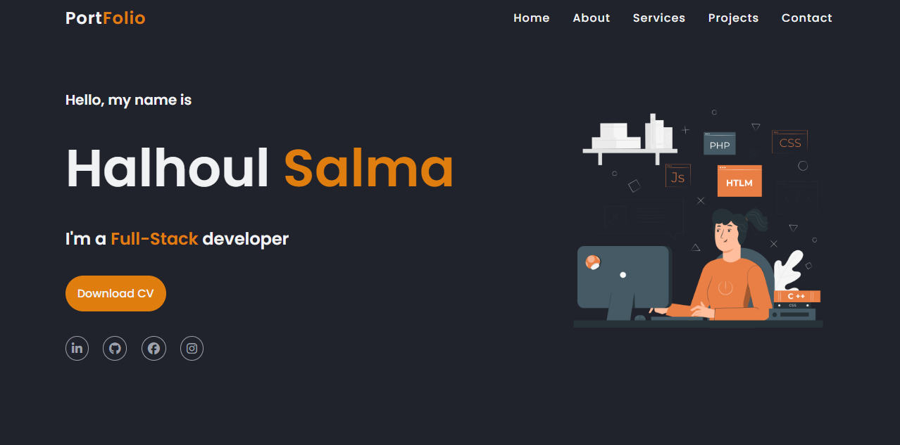

# Portfolio Projet - Formation Digital Maroc School

Bienvenue dans le projet de portfolio de la Formation Digital Maroc School ! Ce portfolio a été créé pour aider les étudiants à développer et présenter leurs compétences dans le cadre de la formation.

## Contenu

1. [Introduction](#introduction)
2. [Aperçu](#aperçu)
3. [Fonctionnalités](#fonctionnalités)
4. [Technologies Utilisées](#technologies-utilisees)
5. [Instructions d'utilisation](#instructions-dutilisation)

## Introduction

Ce projet de portfolio a été conçu pour permettre aux étudiants de la Formation Digital Maroc School de créer et de présenter leur propre portfolio personnel en mettant en valeur leurs compétences, projets et expériences.

## Aperçu



## Fonctionnalités

- **Section Accueil :** Présentation des informations personnelles et reseaux sociaux.
- **Section A propos :** Présentation en bref a propos de vous.
- **Section Services :** Informations sur vos compétences acquis durant la formation académique.
- **Section Projets :** Affichage des projets réalisés avec des descriptions détaillées.
- **Contact :** Formulaire de contact pour permettre aux visiteurs de vous contacter.

## Technologies Utilisées

- **HTML**
- **CSS**
- **Media queries**

## Instructions d'utilisation

**Installation :** Clonez le repository sur votre machine locale.
   ```bash
   git clone https://github.com/sm-hl/portfolio-formation.git


